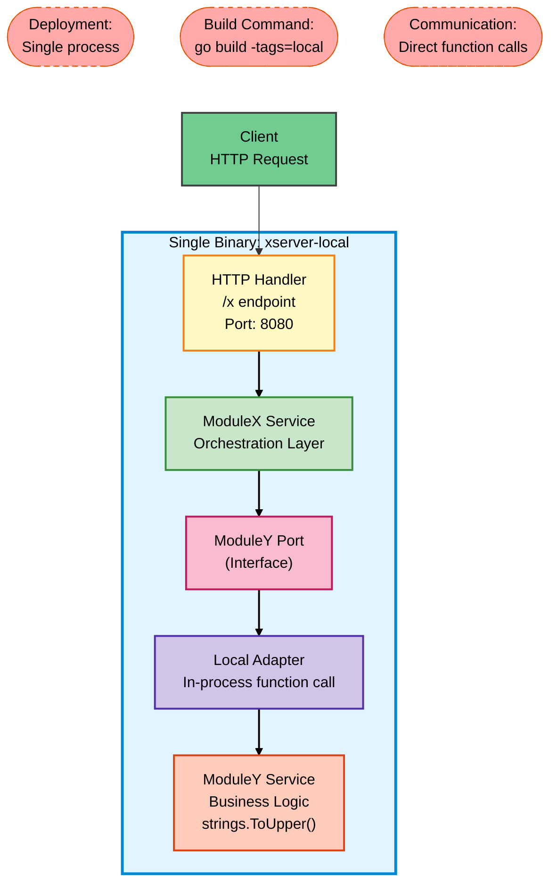

```mermaid
graph TB
    note3(["Deployment:<br/>Single process"])
    note1(["Build Command:<br/>go build -tags=local"])
    note2(["Communication:<br/>Direct function calls"])
    
    client["Client<br/>HTTP Request"]
    
    subgraph binary["Single Binary: xserver-local"]
        direction TB
        http["HTTP Handler<br/>/x endpoint<br/>Port: 8080"]
        modulex["ModuleX Service<br/>Orchestration Layer"]
        port["ModuleY Port<br/>(Interface)"]
        adapter["Local Adapter<br/>In-process function call"]
        moduley["ModuleY Service<br/>Business Logic<br/>strings.ToUpper()"]
        
        http --> modulex
        modulex --> port
        port --> adapter
        adapter --> moduley
    end
    
    client --> http
    
    note3 ~~~ client
    note1 ~~~ client
    note2 ~~~ client
    
    style binary fill:#e1f5ff,stroke:#0288d1,stroke-width:3px,color:#000000
    style http fill:#fff9c4,stroke:#f57f17,stroke-width:2px,color:#000000
    style modulex fill:#c8e6c9,stroke:#388e3c,stroke-width:2px,color:#000000
    style port fill:#f8bbd0,stroke:#c2185b,stroke-width:2px,color:#000000
    style adapter fill:#d1c4e9,stroke:#512da8,stroke-width:2px,color:#000000
    style moduley fill:#ffccbc,stroke:#d84315,stroke-width:2px,color:#000000
    style client fill:#70cc90,stroke:#424242,stroke-width:2px,color:#000000
    style note1 fill:#FAA,stroke:#e65100,stroke-width:1px,stroke-dasharray: 5 5,color:#000000
    style note2 fill:#FAA,stroke:#e65100,stroke-width:1px,stroke-dasharray: 5 5,color:#000000
    style note3 fill:#FAA,stroke:#e65100,stroke-width:1px,stroke-dasharray: 5 5,color:#000000
    
    linkStyle 0,1,2,3 stroke:#000000,stroke-width:2px

```