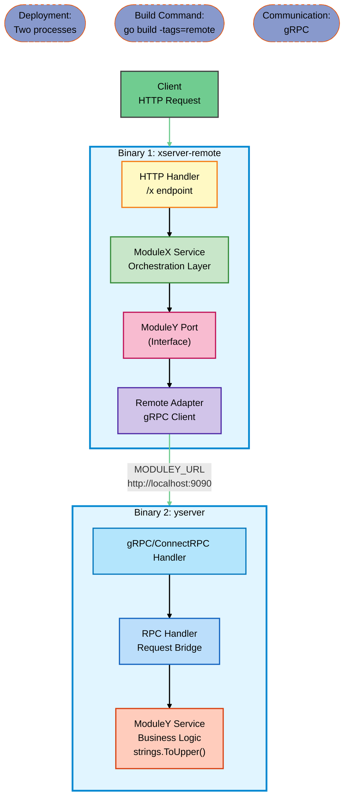

```mermaid
graph TB
    note3(["Deployment:<br/>Two processes"])
    note1(["Build Command:<br/>go build -tags=remote"])
    note2(["Communication:<br/>gRPC"])

    client["Client<br/>HTTP Request"]

    subgraph binary1["Binary 1: xserver-remote"]
        direction TB
        http["HTTP Handler<br/>/x endpoint"]
        modulex["ModuleX Service<br/>Orchestration Layer"]
        port["ModuleY Port<br/>(Interface)"]
        adapter["Remote Adapter<br/>gRPC Client"]
    end

    subgraph binary2["Binary 2: yserver"]
        direction TB
        grpc["gRPC/ConnectRPC Handler"]
        rpcHandler["RPC Handler<br/>Request Bridge"]
        moduley["ModuleY Service<br/>Business Logic<br/>strings.ToUpper()"]
    end

    client --> binary1

    note3 ~~~ client
    note1 ~~~ client
    note2 ~~~ client

    http --> modulex
    modulex --> port
    port --> adapter
    adapter -- "MODULEY_URL<br/>http://localhost:9090" --> binary2
    grpc --> rpcHandler
    rpcHandler --> moduley

    style binary1 fill:#e1f5ff,stroke:#0288d1,stroke-width:3px,color:#000000
    style binary2 fill:#e1f5ff,stroke:#0288d1,stroke-width:3px,color:#000000
    style http fill:#fff9c4,stroke:#f57f17,stroke-width:2px,color:#000000
    style modulex fill:#c8e6c9,stroke:#388e3c,stroke-width:2px,color:#000000
    style port fill:#f8bbd0,stroke:#c2185b,stroke-width:2px,color:#000000
    style adapter fill:#d1c4e9,stroke:#512da8,stroke-width:2px,color:#000000
    style grpc fill:#b3e5fc,stroke:#0277bd,stroke-width:2px,color:#000000
    style rpcHandler fill:#bbdefb,stroke:#1565c0,stroke-width:2px,color:#000000
    style moduley fill:#ffccbc,stroke:#d84315,stroke-width:2px,color:#000000
    style client fill:#70cc90,stroke:#424242,stroke-width:2px,color:#000000

    style note1 fill:#89C,stroke:#e65100,stroke-width:1px,stroke-dasharray: 5 5,color:#000000
    style note2 fill:#89C,stroke:#e65100,stroke-width:1px,stroke-dasharray: 5 5,color:#000000
    style note3 fill:#89C,stroke:#e65100,stroke-width:1px,stroke-dasharray: 5 5,color:#000000

    linkStyle 0 stroke:#70cc90,stroke-width:2px
    linkStyle 7 stroke:#70cc90,stroke-width:2px
    linkStyle 4,5,6,8,9 stroke:#000000,stroke-width:2px
```